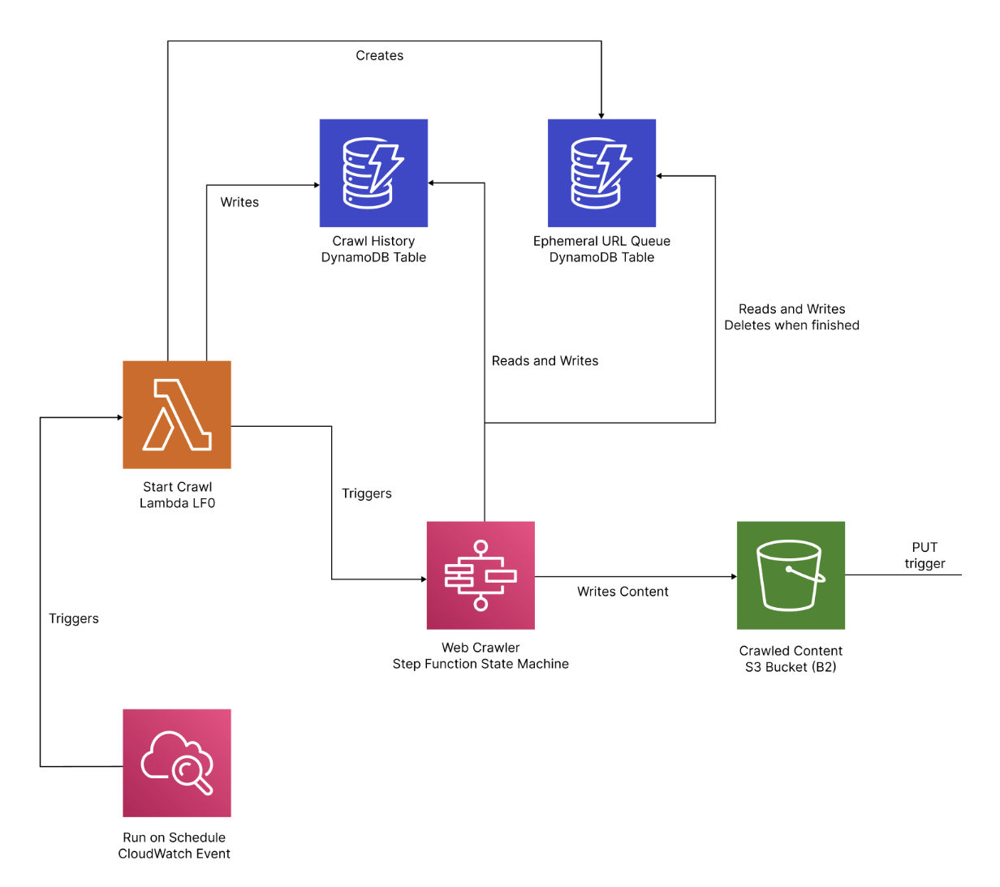
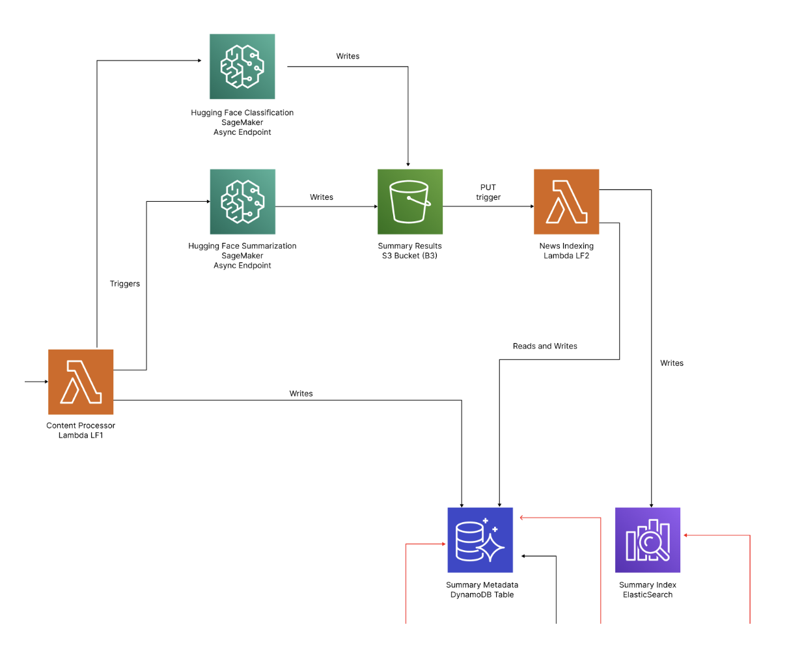
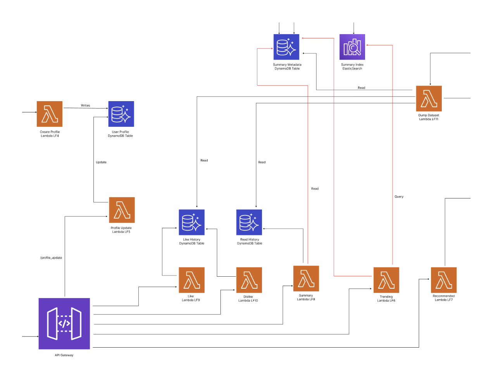
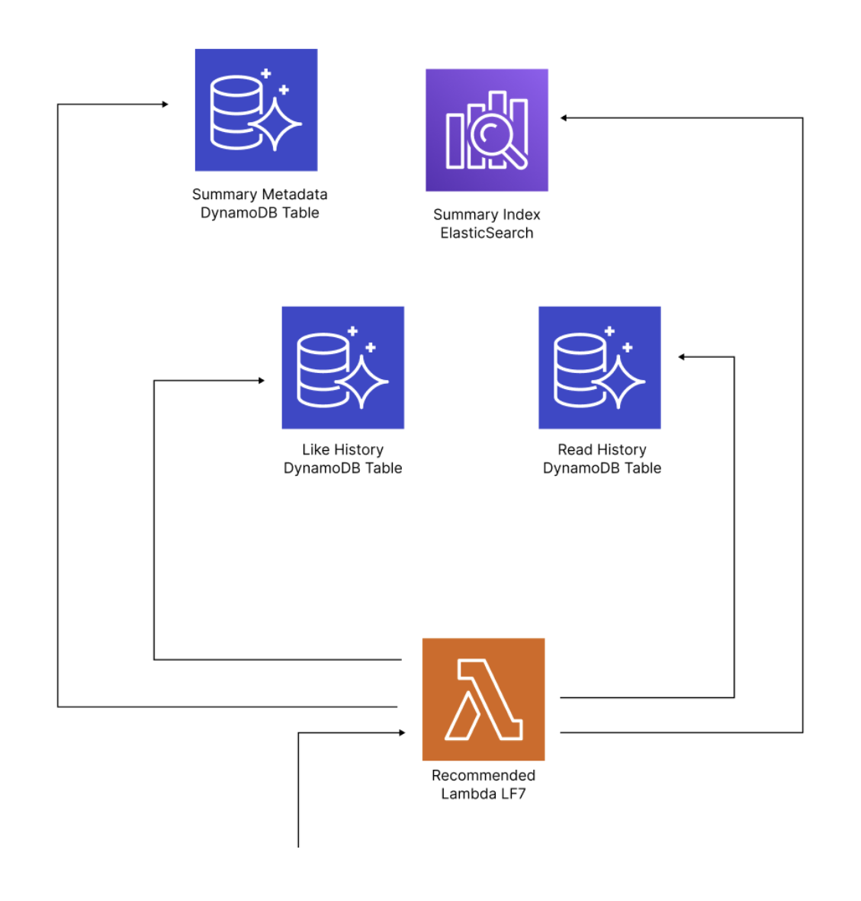

# Daily Digest

Daily Digest is a news summarization web application that is built exclusively using AWS. It uses serverless, microservice architecture with infrastructure-as-code using AWS Cloudformation. We used AWS SageMaker for deploying our inference endpoints.

## Architecture

### Web Crawler

### Content Processing

### API Gateway & Lambda Functions

### Recommender

